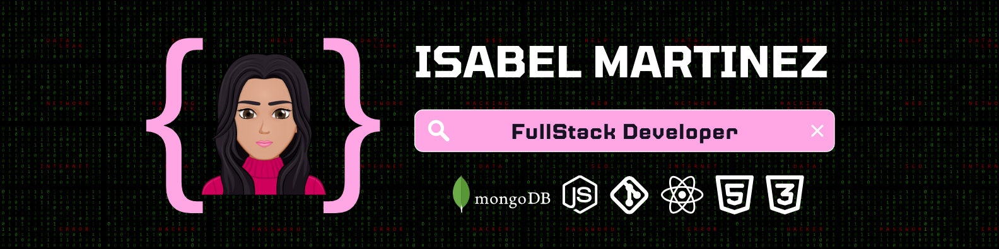

<h1 align="center">Hola, mi nombre es Isabel Martinez 🫶🏻</h1>

  

### 👨🏻‍💻 &nbsp;About Me

🚀 &nbsp; Apasionada por la tecnología \
🎓 &nbsp; Graduada como desarrolladora Fullstack en el Bootcamp Tripleten \
🐶 &nbsp; PetLover forever.\
💬 &nbsp; Me encanta charlar sobre todo tipo de temas, puedes encontrarme en isabelmartinez19.30@gmai.com

  

### 🛠 &nbsp;Tech Stack

### ⚙️ &nbsp;GitHub Analytics

<a href="https://github.com/SoyIsabelMM">
  
  <! --- 
</a>

### 🤝🏻 &nbsp; Encuentrame:

